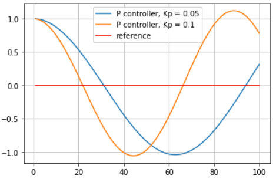
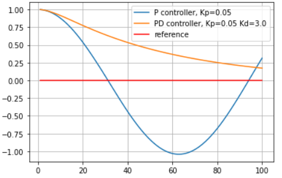
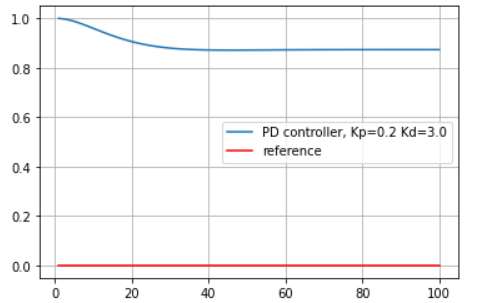
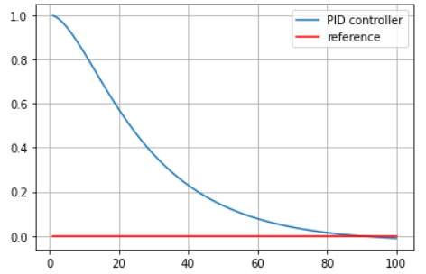

# CarND-Controls-PID
Self-Driving Car Engineer Nanodegree Program

---
## Description
The goal of this project is to implement a PID controller for the steering of a car in a simulation.
The simulator can be found [here](https://github.com/udacity/self-driving-car-sim/releases). The original repository with the starter code of this project can be found [here](https://github.com/udacity/CarND-PID-Control-Project).

## PID Controller
To control the steering of the car, a PID controller was used. The controller tries to minimize the cross track error (cte).
## Choosing the Parameters:
The following analysis of the effect of the different controller parameters was done using the Robot class from the lecture.

### Proportional Response:
the proportional part of the pid controller only depends on cte. 
Increasing **Kp** makes the control systems response faster, but also causes more overshooting as shown in the image below:
<center>
   
</center>
Using just a p Controller causes the car to oscillate around the center of the track.

### Derivative Response:
To counteract the oscillation effect of the proportional component, a derivative component can be added. This component depends on the temporal difference of the cross track error 
(cte - cte_last).
The effect of the derivative component can be seen in the image below.
<center>
   
</center>
The problem with this controller is the fact that it can't solve the systematic bias problem. For example if we add steering drift to the robot model:
<center>
   
</center>

### Integral Response:
The integral component depends on the sum of all the cross track errors. It can solve the systematic bias problem.
<center>
   
</center>

## Twiddle 
The twiddle algorithm was also implement by alternatively running the simulation for a certain period of time and tweaking the parameters of the controller.

As starting from scratch would be time consuming, an initial manual tweaking of the parameters was done. Further automatic fine tuning was done using twiddle.

**Notes**: twiddle was deactivated for the submission by setting the dp vector to zero, so that the parameter of the controller won't deviate from the initial value.  
It can be turned on by setting the parameter **tune** to true (line 48). 
If the tuning process is turned on, the simulation will only run 300 steps and restart each time the parameters are tweaked. 

## Final Parameters:
To start the parameters where manually tweaked to : 
- Kp = 0.15
- Ki = 0.002
- Kd = 2.8
The parameters above where used as initialization for the twiddle algorithm. Further tweaking resulted in:
- Kp = 0.129228
- Ki = 0.000114816
- Kd = 1.96532

## Dependencies

* cmake >= 3.5
 * All OSes: [click here for installation instructions](https://cmake.org/install/)
* make >= 4.1(mac, linux), 3.81(Windows)
  * Linux: make is installed by default on most Linux distros
  * Mac: [install Xcode command line tools to get make](https://developer.apple.com/xcode/features/)
  * Windows: [Click here for installation instructions](http://gnuwin32.sourceforge.net/packages/make.htm)
* gcc/g++ >= 5.4
  * Linux: gcc / g++ is installed by default on most Linux distros
  * Mac: same deal as make - [install Xcode command line tools]((https://developer.apple.com/xcode/features/)
  * Windows: recommend using [MinGW](http://www.mingw.org/)
* [uWebSockets](https://github.com/uWebSockets/uWebSockets)
  * Run either `./install-mac.sh` or `./install-ubuntu.sh`.
  * If you install from source, checkout to commit `e94b6e1`, i.e.
    ```
    git clone https://github.com/uWebSockets/uWebSockets 
    cd uWebSockets
    git checkout e94b6e1
    ```
    Some function signatures have changed in v0.14.x. See [this PR](https://github.com/udacity/CarND-MPC-Project/pull/3) for more details.
* Simulator. You can download these from the [project intro page](https://github.com/udacity/self-driving-car-sim/releases) in the classroom.


## Basic Build Instructions

1. Clone this repo.
2. Make a build directory: `mkdir build && cd build`
3. Compile: `cmake .. && make`
4. Run it: `./pid`. 

Tips for setting up your environment can be found [here](https://classroom.udacity.com/nanodegrees/nd013/parts/40f38239-66b6-46ec-ae68-03afd8a601c8/modules/0949fca6-b379-42af-a919-ee50aa304e6a/lessons/f758c44c-5e40-4e01-93b5-1a82aa4e044f/concepts/23d376c7-0195-4276-bdf0-e02f1f3c665d)

